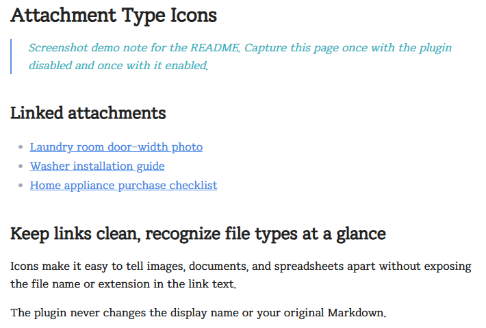
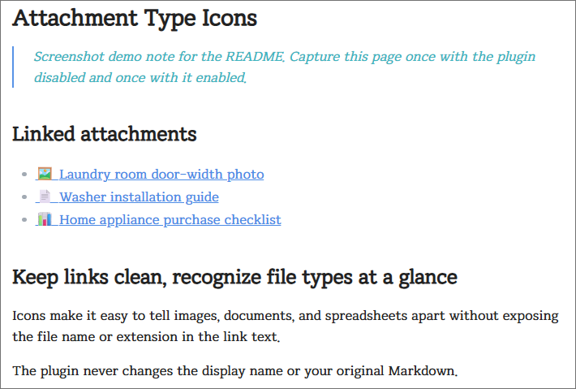

# Attachment Type Icons

[English](README.md) | 한국어

일반 첨부파일 링크 앞에 파일 유형 아이콘을 자동으로 표시하는 Obsidian 커뮤니티 플러그인입니다. Markdown 원본, 파일명, 링크 별칭은 변경하지 않으며, 임베드와 미리보기에는 아이콘을 추가하지 않습니다.

## 만든 이유

첨부파일 링크에는 읽기 쉬운 표시 이름을 붙이는 경우가 많습니다. 노트는 깔끔해지지만, 그 링크가 이미지인지 PDF인지 스프레드시트인지 바로 알기 어려워집니다. Attachment Type Icons는 링크 텍스트는 그대로 유지하면서, 파일 유형을 한눈에 알아볼 수 있는 최소한의 시각적 단서를 더합니다.

## 적용 전과 후

**적용 전 — 링크 텍스트만으로는 파일 유형을 알기 어렵습니다.**



**적용 후 — 아이콘으로 링크 대상의 파일 유형을 바로 구분할 수 있습니다.**



## 표시 예시

일반 내부 링크를 작성합니다.

```md
[[90_Attachments/images/photo.jpg|세탁실 치수 사진]]
```

읽기 화면에서는 다음과 같이 표시됩니다.

```text
🖼️ 세탁실 치수 사진
```

아이콘은 화면에 표시되는 링크에만 추가됩니다. Markdown, 파일명, 링크 별칭은 그대로 유지됩니다.

## 설치

1. 최신 릴리즈에서 `main.js`, `manifest.json`, `styles.css`를 다운로드합니다.
2. 세 파일을 `<보관함>/.obsidian/plugins/attachment-type-icons/`에 넣습니다.
3. Obsidian을 다시 불러온 뒤 **설정 → 커뮤니티 플러그인**에서 **Attachment Type Icons**를 활성화합니다.

## 기본 지원 파일 유형

아래 유형은 기본으로 활성화되어 있습니다. 확장자는 대소문자를 구분하지 않습니다.

| 유형 | 기본 아이콘 | 기본 확장자 |
| --- | --- | --- |
| 이미지 | 🖼️ | `jpg`, `jpeg`, `png`, `gif`, `webp`, `svg`, `heic` |
| PDF·문서 | 📄 | `pdf`, `doc`, `docx`, `hwp`, `txt`, `rtf` |
| 스프레드시트 | 📊 | `xlsx`, `xls`, `csv`, `ods` |
| 오디오 | 🔊 | `mp3`, `m4a`, `wav`, `ogg`, `flac` |
| 영상 | 🎬 | `mp4`, `mov`, `webm`, `mkv` |
| 압축 파일 | 📦 | `zip`, `7z`, `rar`, `tar`, `gz` |

Markdown 노트 링크는 `📝` 아이콘으로 표시할 수 있으며, 기본값은 비활성화입니다.

## 설정

**설정 → Attachment Type Icons**에서 각 유형을 간단히 설정할 수 있습니다.

- **활성화/비활성화:** 유형별 아이콘 표시 여부를 토글로 변경합니다.
- **아이콘 변경:** 원하는 이모지 또는 문자로 바꿉니다.
- **확장자 편집:** 쉼표로 구분해 확장자를 추가하거나 삭제합니다.

예를 들어 이미지에 `heif`, `avif` 형식을 추가하려면 확장자 입력란을 아래처럼 수정합니다.

```text
jpg, jpeg, png, gif, webp, svg, heic, heif, avif
```

`.pdf, .epub`처럼 점을 붙여 입력해도 됩니다. 점은 자동으로 제거되므로 `.PDF`와 `pdf` 모두 같은 방식으로 처리됩니다.

## 동작 범위

- 일반 내부 첨부파일 링크에서 작동합니다.
- `![[photo.jpg]]`와 같은 임베드에는 아이콘을 추가하지 않습니다. 미리보기만으로 파일 유형을 알 수 있기 때문입니다.
- 보관함 전체를 스캔하거나 파일을 수정하지 않습니다. 노트가 렌더링될 때 해당 노트의 내부 링크만 확인합니다.

## 개발

```bash
npm install
npm run dev
```

배포용 최소화 번들은 아래 명령으로 생성합니다.

```bash
npm run build
```
